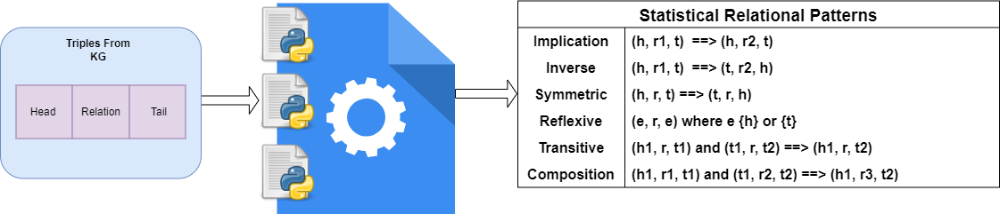

# Pattern Locator KG
[](https://www.python.org/downloads/release/python-390/)
[](https://opensource.org/licenses/MIT)

## Finding statistical relational patterns

## Workflow

<div align="center">
  
</div>
## Description
The Pattern Locator KG is a repository that contains a pattern matching algorithm that locates specific patterns in a given dataset from knowledge graphs triplets.
Currently the project supports the following pattern extraction from KGs:
  - Reflection
  - Symmetry
  - Transitivity
  - Implication
  - Inverse
  - Composition

## Installation

To install and run the program, follow these steps:

1. Clone this repository to your local machine.
2. Install the required dependencies by running the command `pip install -r requirements.txt`.
3. Run the program using the following command 
  ```Command
  python relational_pattern_lookout.py --data_dir <DATA_DIRECTORY> --data_name <DATASET_NAME> --file_name <FILE_NAME> --save_pattern_dir <DIRECTORY_NAME_FOR_SAVING_PATTERNS> 
   ```

## Usage

The program takes a dataset and a knowledge graph as inputs, and outputs the locations of specific patterns within the dataset. To use the program, follow these steps:

1. Prepare your dataset and knowledge graph files in the appropriate format normally in a text set where we have {h,r,t}.
2. Run the program using the following command 
  ```Command
  python relational_pattern_lookout.py --data_dir <DATA_DIRECTORY> --data_name <DATASET_NAME> --file_name <FILE_NAME> --save_pattern_dir <DIRECTORY_NAME_FOR_SAVING_PATTERNS> 
   ```
## Arguments:
  
**DATA_DIRECTORY** is the directory containing the dataset

**DATASET_NAME** is the name of the dataset file (including the extension)

**FILE_NAME** is the name of the file to save the identified patterns in (including the extension)

**DIRECTORY_NAME_FOR_SAVING_PATTERNS** is the directory name for saving the identified patterns.
The program will output the detected patterns in the given location

## General Structure of the Repository
```bash
.
├── data/
│   └── dataset1/
│   │   ├── saved_patterns/
│   │   │   ├── implication_patterns.txt
│   │   │   ├── inverse_patterns.txt
│   │   │   ├── reflection_patterns.txt
│   │   │   ├── symmetric_patterns.txt
│   │   │   ├── transitive_patterns.txt
│   │   │   └── composition_patterns.txt
│   │   └── train.txt 
│   └── dataset2/
│   │   └── ...
├── utils/
│   ├── utility_functions.py
│   └── ...
├── temporal_pattern/
│   ├── evaluation.py
│   ├── run.py
│   ├── temporal_pattern_lookout.py
│   ├── tpl.py
│   ├── utilities.py
│   └── ...
├── README.md
├── requirements.txt
├── .gitignore
├── relational_pattern_lookout.py
└── ...
```

## Files for statistical pattern lookout
- **relational_pattern_lookout.py**: This is the main file for the statistical pattern lookout. It contains the main function that calls the other functions in the program.
- **utility_functions.py**: This file contains the utility functions (including the codes to find statistical patterns) used in the program.

## Temporal Pattern Lookout:
- This script is to find pattern in (Temporal) Knowledge Graph. The file format is in quaternion (subject, predicate, object, time) or triples ((subject, predicate, object).
- Unzip the data.zip in the same folder as folder 'temporal_pattern_lookout'
How to run:
  two hyperparameters needed to be determined, i.e. dataset and threshold for pattern lookup table. 
  example: 
  - python run.py --dataset icews15 --threshold 0.5

## Contributing

If you want to contribute to this repository, please fork the repository, create a new branch, make your changes, and submit a pull request with a detailed description of your changes.


## License

This repository is licensed under the [MIT License](LICENSE).